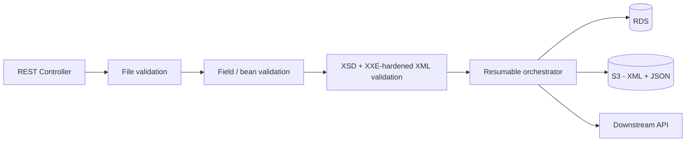

# Secure XML Processing Service

A Java 17 / Spring Boot 3 service that accepts a company XML file plus metadata, validates it securely (file limits, XSD, business rules), stores the canonical XML/JSON in S3, records resumable processing state in a relational database, and calls a downstream API. Infrastructure (S3 + RDS) is provisioned with Terraform.

## Architecture



- **File validation** — rejects empty, oversized, or non-XML uploads before any parsing happens.
- **Field validation** — `companyId`, `companyName`, and `date` are required and format-checked via Jakarta Bean Validation.
- **XML validation** — DTDs, external entities, and external schema resolution are disabled; depth, element count, and text-size limits are enforced before JAXB unmarshalling.
- **Resumable orchestrator** — claims an idempotency key in a short DB transaction, then performs S3 and downstream calls outside any transaction, so a failed request can resume at its next incomplete stage instead of restarting.
- **Errors** never include input bodies, credentials, SQL, downstream response bodies, file paths, or stack traces.

## API

### Submit a file for processing

```bash
curl -X POST "http://localhost:8080/api/process" \
  -F "file=@/path/to/company.xml" \
  -F "companyId=US0378331005" \
  -F "companyName=Apple Inc." \
  -F "date=2026-09-06"
```

| Field | Required | Notes |
|---|---|---|
| `file` | Yes | XML file, size capped by `app.upload.max-size-bytes` |
| `companyId` | Yes | Alphanumeric identifier |
| `companyName` | Yes | Max 200 characters |
| `date` | Yes | ISO date, must not be in the future |

### Check processing status

```bash
curl -i http://localhost:8080/api/process/{id}/status
```

Returns the current stage (`RECEIVED`, `XML_STORED`, `JSON_STORED`, `COMPLETED`, `FAILED`) and, on failure, a short reason code rather than a raw error message.

### Docs and health

- Swagger UI: `http://localhost:8080/swagger-ui.html`
- Health: `/actuator/health`
- Metrics: `/actuator/prometheus`

## Run locally

Prerequisites: Docker Compose, or Java 17 plus a local database/S3/downstream stack.

```bash
docker compose up --build
```

## Configuration

The application requires the following environment variables in production:

```bash
export DB_URL="jdbc:mysql://<host>:3306/appdb"
export DB_USERNAME="admin"
export DB_PASSWORD="********"
export S3_BUCKET="my-java-app-bucket-2026-unique"
export AWS_ACCESS_KEY_ID="your-access-key"
export AWS_SECRET_ACCESS_KEY="your-secret-key"
export DOWNSTREAM_URL="https://downstream.example.com"
```

AWS credentials are read from environment variables and supplied to the S3 client via a static credentials provider — **never** commit real credentials to `application.yaml`, source control, or Terraform files. AWS region defaults to `ap-south-1`. `S3_ENDPOINT` and path-style access are for local emulators only. File size limits, XML depth/element/text limits, S3 timeouts/retries, and downstream timeouts/retries are all typed under `app.*` in `application.yaml`.

## Database migrations

Schema changes are managed with Flyway under `src/main/resources/db/migration`. `V2__add_company_upload_details.sql` adds `company_id`, `company_name`, and `submitted_date` to `file_processing`, backfills existing rows, then enforces `NOT NULL`.

## Infrastructure (Terraform)

Terraform provisions the S3 bucket and RDS instance the service depends on:

```
terraform {
  required_providers {
    aws = {
      source  = "hashicorp/aws"
      version = "~> 6.0"
    }
  }
  required_version = ">= 1.5.0"
}
```

- **S3** — `aws_s3_bucket.app_bucket`, with public access blocked (`aws_s3_bucket_public_access_block`) and versioning enabled.
- **RDS** — `aws_db_instance.mysql`, MySQL 8.0, `db.t3.micro`, 20 GB gp3 storage.

```bash
cd infra/
terraform init
terraform plan
terraform apply
```

Outputs: `s3_bucket_name`, `s3_bucket_arn`, `mysql_endpoint`, `mysql_database`, `mysql_username`.

> **Before using this in anything beyond local/dev experimentation**, address the following in the Terraform:
> - Remove `access_key` / `secret_key` from the `provider "aws"` block entirely — leave AWS credential resolution to the standard chain (env vars, `~/.aws/credentials`, or an IAM role) instead of hardcoding them into a file that can be committed.
> - Move `password = "ChangeMe123!"` out of the `.tf` file — use a `variable` sourced from a `.tfvars` file (git-ignored) or a secrets manager, not a literal in source control.
> - `publicly_accessible = true` on the RDS instance exposes the database to the internet; set it to `false` and reach it through a VPC/security group instead.
> - `skip_final_snapshot = true` and `backup_retention_period = 0` mean a deleted or failed instance is unrecoverable — fine for a throwaway dev sandbox, not for anything with real data.
