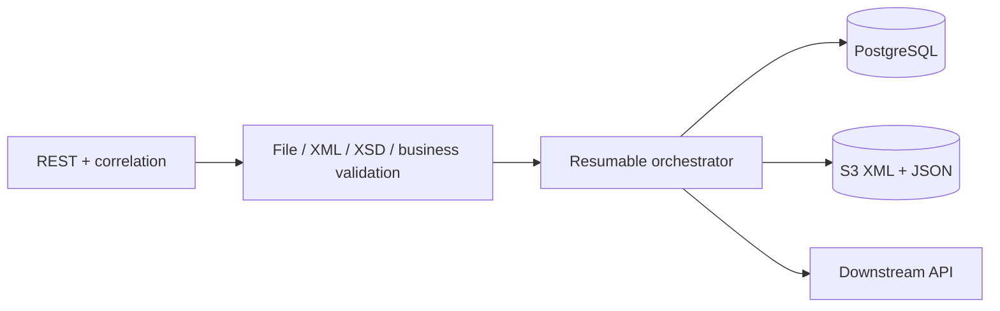

# Secure XML Processing Service

Java 17 / Spring Boot 3 service that accepts XML, validates it securely against XSD and bean business rules, stores canonical XML and JSON in S3, records resumable state in PostgreSQL, and calls a downstream API.

## Run locally

Prerequisites: Docker Compose, or Java 17 plus PostgreSQL/S3/downstream services.

```bash
docker compose up --build
```

Swagger UI is at `http://localhost:8080/swagger-ui.html`; health is at `/actuator/health` and Prometheus metrics at `/actuator/prometheus`.

```bash
curl -i -X POST http://localhost:8080/api/v1/files/process \
  -H 'Idempotency-Key: demo-1' -H 'X-Correlation-ID: demo-correlation' \
  -F 'file=@src/test/resources/examples/valid-company.xml;type=application/xml'
```

The XML namespace is `https://example.com/company-record` and the required order is `companyName`, `id`, `date`:

```xml
<?xml version="1.0" encoding="UTF-8"?>
<companyRecord xmlns="https://example.com/company-record">
  <companyName>Acme Ltd</companyName><id>42</id><date>2024-01-01</date>
</companyRecord>
```

## Configuration

Production requires `DB_URL`, `DB_USERNAME`, `DB_PASSWORD`, `S3_BUCKET`, `AWS_ACCESS_KEY_ID`, `AWS_SECRET_ACCESS_KEY`, and `DOWNSTREAM_URL`. AWS region defaults to `ap-south-1`. The application reads the AWS access and secret keys from environment variables and supplies them to the S3 client through a static credentials provider; never commit real credentials to `application.yaml` or source control. `S3_ENDPOINT` and path style are intended for local emulators only. File size, XML depth/element/text limits, S3 timeouts/retries, and downstream timeouts/retries are typed under `app.*` in `application.yaml`.

```bash
export AWS_ACCESS_KEY_ID="your-access-key"
export AWS_SECRET_ACCESS_KEY="your-secret-key"
export S3_BUCKET="your-bucket"
```

## Design



The unique idempotency key is claimed before side effects. The SHA-256 body hash prevents reuse with different content. State transitions (`RECEIVED`, `XML_STORED`, `JSON_STORED`, `COMPLETED`, `FAILED`) use short independent transactions; no transaction spans S3 or HTTP. Deterministic object keys make retries overwrite-safe, and stored keys allow a failed request to resume at the next incomplete stage.

XML hardening disallows DTDs and external entities/schemas, enables secure processing, rejects external resolution, and caps depth, element count, total text, and per-element text before JAXB. Errors never include input bodies, credentials, SQL, provider/downstream bodies, paths, or stack traces.

## Tests and delivery

Run `./mvnw clean verify`. Unit tests cover file, XSD, business, XXE/DTD, bomb limits, idempotency, storage translation, downstream behavior, orchestration, and REST. CI runs verification, publishes the JaCoCo report, and builds the non-root Java 17 image. The architecture intentionally separates pure validation/mapping, durable state, and network adapters so each failure boundary can be tested and discussed independently in an interview.
